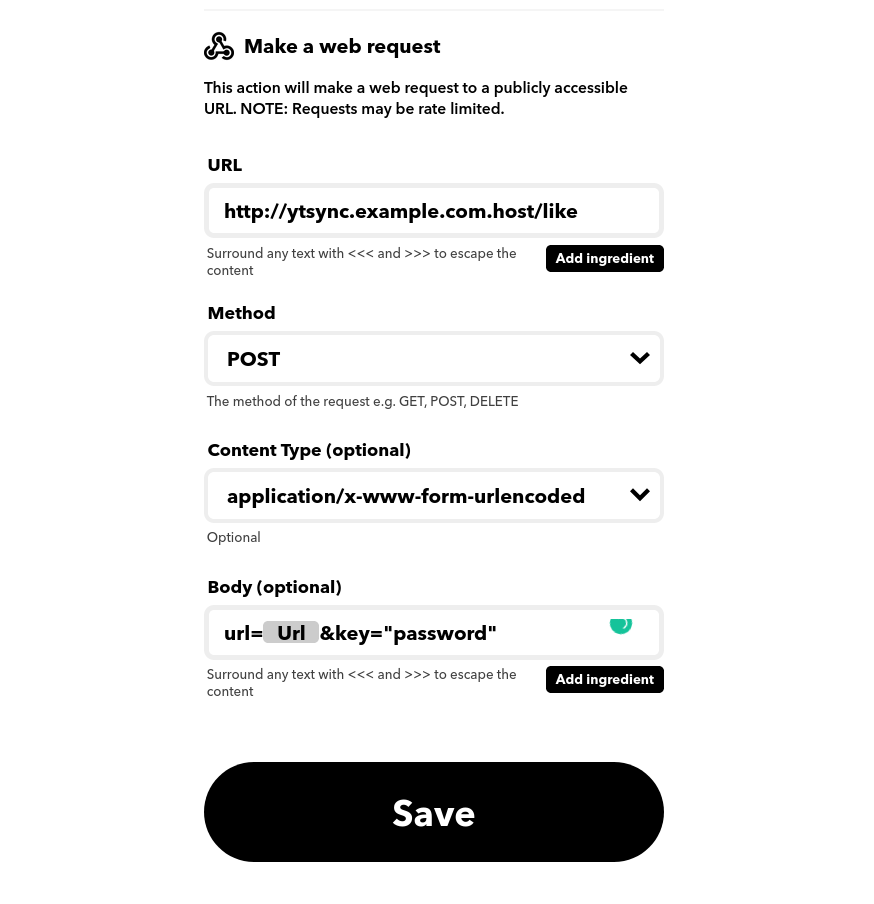

# YTSync

A quick tool i made to work with [ytdlrc](https://github.com/bardisty/ytdlrc) to hook into IFTTT and download videos from a youtube "generated playlist" (IE. Liked Videos).

## Why

At the time of making this youtube has a broken UI (Polymer UI) for youtubes privacy settings page, preventing you from checking your liked videos playlist from private to public, this has been
broken for at least 6 months now and youtube automatically switched my playlist from public to private without warning or alerting me so this workaround is necessary.

## How

Set up IFTTT to link into youtubes system using your google account. IFTTT handles all the oauth stuff in the background which means less work for me. Then set up a **If new like Then POST to webhook** like so.

Set up a URL and you are good to go.

### Set up nginx proxy

Modify and copy nginx/nginx.conf for your needs, it will reverse proxy traffic to your express app.
